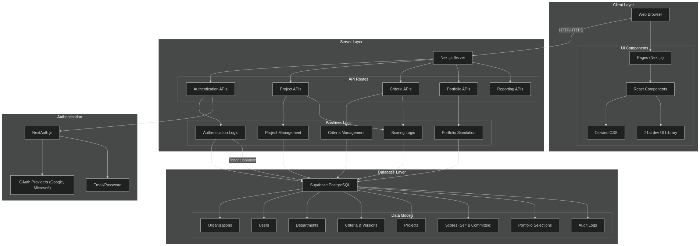
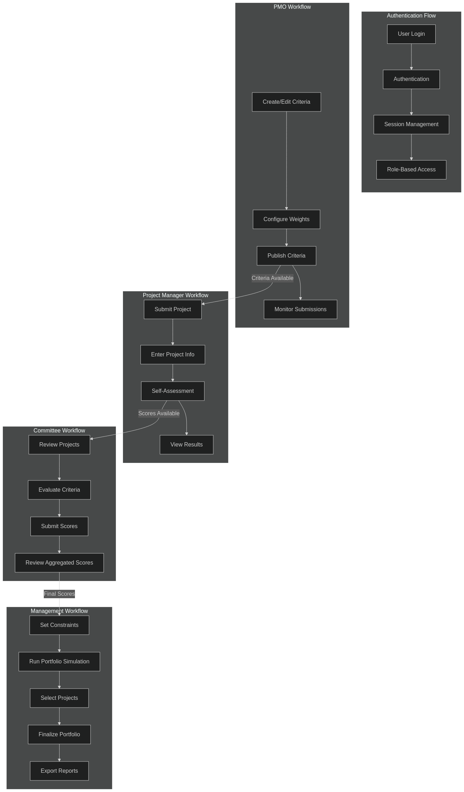
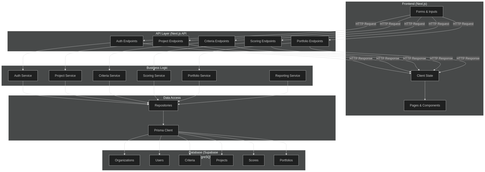
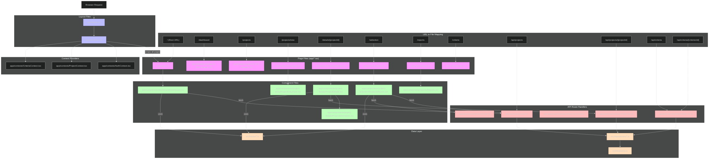

# PrimePM System Architecture

## Introduction

PrimePM is a SaaS Project Management Information System (PMIS) built with Next.js. It focuses on project selection and portfolio prioritization during the initiation phase of project management. The system combines Next.js for the frontend and backend (API routes) with Supabase PostgreSQL for data storage, delivering a secure, multi-tenant environment.

The system supports:
- Dynamic definition of project selection criteria
- Weighted scoring (including self-assessment and committee scoring)
- Portfolio simulation based on real-time constraints (budget, resources, strategic alignment)
- Authentication via Email/Password, Google, or Microsoft accounts

## System Architecture

The PrimePM system follows a layered architecture design:

*System Architecture Diagram: Shows the layered design with client, server, and database components, including their interactions.*

## User Workflows

The system supports different user roles, each with specific workflows:

*User Workflows Diagram: Visualizes how different user roles (PMO, Project Manager, Committee, Management) interact with the system through their specific processes.*

## Data Flow

This diagram shows how information moves through the various system layers:

*Data Flow Diagram: Illustrates how information moves from the frontend through API layers, business logic, and ultimately to the database and back.*

## URL to File Mapping

This diagram shows the Next.js App Router structure and how URLs map to specific files:

*URL to File Mapping Diagram: Details the Next.js routing structure showing the relationship between URLs, page files, components, and API routes.*

## Next.js Request Flow Explanation

When a user enters a URL in the browser, here's how Next.js processes it and which files are involved:

### URL to File Mapping in Next.js App Router

- **Root URL (/)** → `app/page.tsx`
- **/dashboard** → `app/dashboard/page.tsx` (would need to be created)
- **/projects/new** → `app/projects/new/page.tsx`
- **/details/[projectId]** → `app/details/[projectId]/page.tsx`
- **/selection** → `app/selection/page.tsx`
- **/reports** → `app/reports/page.tsx`
- **/criteria** → `app/criteria/page.tsx`

API routes follow a similar pattern:
- **/api/projects** → `app/api/projects/route.ts`
- **/api/projects/[projectId]** → `app/api/projects/[projectId]/route.ts`

### Request Flow Steps

1. **HTTP Request**: User enters URL in browser
2. **Layout Tree**: Request first goes through `app/layout.tsx` (root layout)
3. **Context Providers**: `app/providers.tsx` wraps all pages with context providers
4. **Page Component**: The specific page file is rendered (e.g., `app/details/[projectId]/page.tsx`)
5. **Page Components**: The page imports and renders components (e.g., `ProjectDetails.tsx`)
6. **Data Fetching**: Components may:
   - Use context data from providers
   - Call custom hooks (`src/hooks/useProjects.ts`, etc.)
   - Make direct API calls to internal API routes

## Debugging Guide

When debugging an issue, here's the progression of files to check:

### For Page/UI Issues:
1. Start with the specific **page file** (e.g., `app/details/[projectId]/page.tsx`)
2. Check the **main component** used by that page (e.g., `app/_components/project-details/ProjectDetails.tsx`)
3. Check sub-components (e.g., `ProjectInformation.tsx`)
4. Check context providers if state-related (`app/_contexts/ProjectContext.tsx`)

### For Data/Backend Issues:
1. Check the relevant **API route handler** (e.g., `app/api/projects/[projectId]/route.ts`)
2. Examine the **repository file** being used (e.g., `src/repositories/ProjectRepository.ts`)
3. Inspect **data hooks** that fetch the data (e.g., `src/hooks/useProjects.ts`)
4. Check **Prisma client** config and connection (`src/lib/prisma.ts`)

### For Specific Pages:

**Project Details Page** (`/details/[projectId]`):
- Page file: `app/details/[projectId]/page.tsx`
- Main component: `app/_components/project-details/ProjectDetails.tsx`
- Sub-component: `app/_components/project-details/ProjectInformation.tsx`
- API route: `app/api/projects/[projectId]/route.ts`
- Data hook: `src/hooks/useProjects.ts`

**Project Selection Page** (`/selection`):
- Page file: `app/selection/page.tsx`
- Main component: `app/_components/project-selection/ProjectSelection.tsx`
- API routes: `app/api/projects/route.ts` and `app/api/criteria/versions/route.ts`
- Data hooks: `src/hooks/useProjects.ts` and `src/hooks/useCriteria.ts`

**Project Entry Page** (`/projects/new`):
- Page file: `app/projects/new/page.tsx`
- Main component: `app/_components/project-entry/ProjectEntryForm.tsx`
- API route: `app/api/projects/route.ts` (POST method)
- Data hooks: `src/hooks/useProjects.ts`

**Reports Page** (`/reports`):
- Page file: `app/reports/page.tsx`
- Main component: `app/_components/reports/Reports.tsx`
- API routes: Various, likely including project and portfolio endpoints
- Data hooks: Multiple, depending on report types

## Database Structure

The system uses Prisma ORM to interact with the Supabase PostgreSQL database. Key models include:

1. **Organization** - Represents a tenant in the multi-tenant system
2. **User** - System users with roles and organizational affiliations
3. **Department** - Organizational departments that projects belong to
4. **CriteriaVersion** - Versioned sets of criteria for project evaluation
5. **Criterion** - Individual evaluation criteria with weights and scales
6. **Project** - Projects that are submitted for evaluation and selection
7. **ProjectCriteriaScore** - Self-assessment scores for projects
8. **CommitteeScore** - Committee member evaluations of projects
9. **PortfolioSelection** - Selected portfolios with constraints
10. **PortfolioProject** - Projects included in a portfolio selection
11. **PairwiseComparison** - Comparisons for the Analytical Hierarchy Process
12. **AuditLog** - System activity logs

These models are fully defined in the Prisma schema and form the foundation of the system's data structure.
