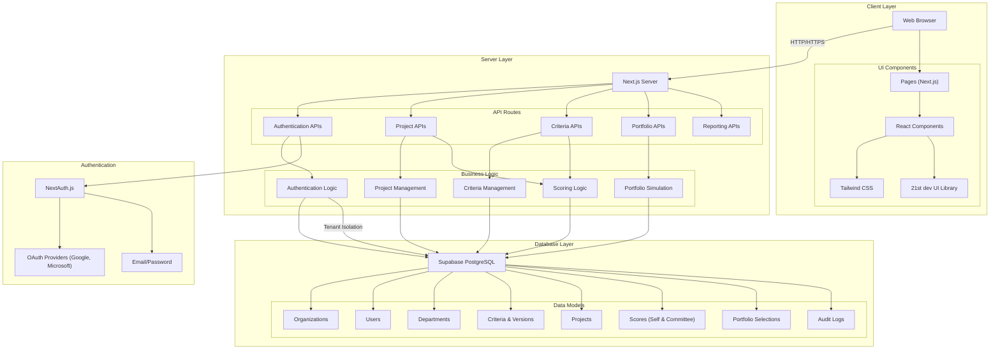
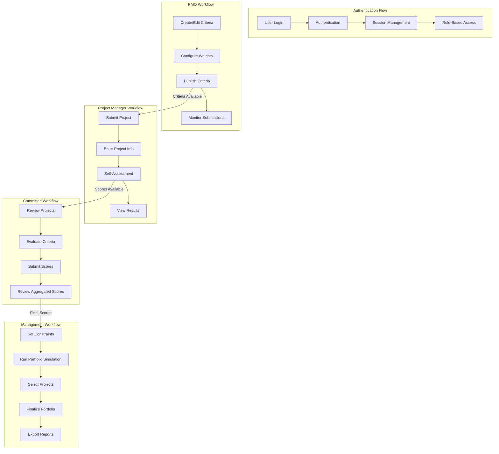
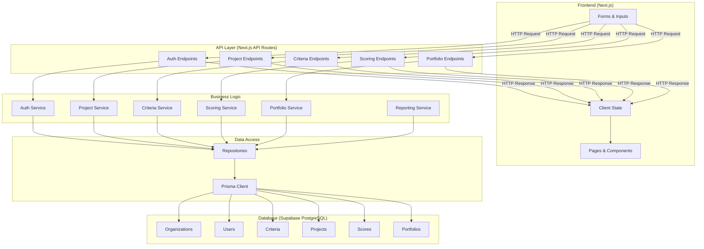

# Diagram Generation Instructions

This directory contains the diagram source code and images for the PrimePM system architecture.

## How to Generate Images

1. Copy the Mermaid code for each diagram below
2. Visit [Mermaid Live Editor](https://mermaid.live/)
3. Paste the code into the editor
4. Use the "Export" button to download as PNG or SVG
5. Save the image in this directory with the appropriate filename

## Diagram Source Code

### System Architecture (system_architecture.png)



### User Workflows (user_workflows.png)



### Data Flow (data_flow.png)



### URL to File Mapping (url_file_mapping.png)

```mermaid
flowchart TD
    classDef pageFiles fill:#f9f,stroke:#333,stroke-width:2px
    classDef layoutFiles fill:#bbf,stroke:#333,stroke-width:2px
    classDef componentFiles fill:#bfb,stroke:#333,stroke-width:2px
    classDef apiFiles fill:#fbb,stroke:#333,stroke-width:2px
    classDef dataFiles fill:#fdb,stroke:#333,stroke-width:2px
    
    Browser[Browser Request]
    
    subgraph "URL to File Mapping"
        URL_Root["/ (Root URL)"]
        URL_Dashboard["/dashboard"]
        URL_Projects["/projects"]
        URL_ProjectsNew["/projects/new"]
        URL_Details["/details/[projectId]"]
        URL_Selection["/selection"]
        URL_Reports["/reports"]
        URL_Criteria["/criteria"]
        
        URL_API_Projects["/api/projects"]
        URL_API_Projects_ID["/api/projects/[projectId]"]
        URL_API_Criteria["/api/criteria"]
        URL_API_Criteria_ID["/api/criteria/[criterionId]"]
    end
    
    subgraph "Page Files (app/*.tsx)"
        Page_Root["app/page.tsx"]:::pageFiles
        Page_Dashboard["app/dashboard/page.tsx (Not created yet)"]:::pageFiles
        Page_Projects["app/projects/page.tsx (Not created yet)"]:::pageFiles
        Page_ProjectsNew["app/projects/new/page.tsx"]:::pageFiles
        Page_Details["app/details/[projectId]/page.tsx"]:::pageFiles
        Page_Selection["app/selection/page.tsx"]:::pageFiles
        Page_Reports["app/reports/page.tsx"]:::pageFiles
        Page_Criteria["app/criteria/page.tsx"]:::pageFiles
    end
    
    subgraph "Layout Files"
        RootLayout["app/layout.tsx"]:::layoutFiles
        Providers["app/providers.tsx"]:::layoutFiles
    end
    
    subgraph "Component Files"
        ProjectDetails["app/components/project-details/ProjectDetails.tsx"]:::componentFiles
        ProjectInformation["app/components/project-details/ProjectInformation.tsx"]:::componentFiles
        ProjectSelectionComp["app/components/project-selection/ProjectSelection.tsx"]:::componentFiles
        ProjectEntryForm["app/components/project-entry/ProjectEntryForm.tsx"]:::componentFiles
        ReportsComponent["app/components/reports/Reports.tsx"]:::componentFiles
        DashboardComponent["app/components/dashboard/Dashboard.tsx"]:::componentFiles
    end
    
    subgraph "API Route Handlers"
        API_Projects["app/api/projects/route.ts"]:::apiFiles
        API_Projects_ID["app/api/projects/[projectId]/route.ts"]:::apiFiles
        API_Projects_Scores["app/api/projects/[projectId]/scores/route.ts"]:::apiFiles
        API_Criteria["app/api/criteria/[criterionId]/route.ts"]:::apiFiles
        API_Criteria_Versions["app/api/criteria/versions/route.ts"]:::apiFiles
    end
    
    subgraph "Context Providers"
        AuthContext["app/contexts/AuthContext.tsx"]
        ProjectContext["app/contexts/ProjectContext.tsx"]
        CriteriaContext["app/contexts/CriteriaContext.tsx"]
    end
    
    subgraph "Data Layer"
        Repositories["src/repositories/*.ts"]:::dataFiles
        Hooks["src/hooks/*.ts"]:::dataFiles
        PrismaClient["src/lib/prisma.ts"]:::dataFiles
    end
    
    %% URL to Page File mapping
    URL_Root --> Page_Root
    URL_Dashboard --> Page_Dashboard
    URL_Projects --> Page_Projects
    URL_ProjectsNew --> Page_ProjectsNew
    URL_Details --> Page_Details
    URL_Selection --> Page_Selection
    URL_Reports --> Page_Reports
    URL_Criteria --> Page_Criteria
    
    %% URL to API mapping
    URL_API_Projects --> API_Projects
    URL_API_Projects_ID --> API_Projects_ID
    URL_API_Criteria --> API_Criteria
    URL_API_Criteria_ID --> API_Criteria
    
    %% Page to Component mapping
    Page_Root --> DashboardComponent
    Page_Selection --> ProjectSelectionComp
    Page_Details --> ProjectDetails
    Page_ProjectsNew --> ProjectEntryForm
    Page_Reports --> ReportsComponent
    
    %% Component relationships
    ProjectDetails --> ProjectInformation
    
    %% Layout relationships
    Browser --> RootLayout
    RootLayout --> Providers
    Providers --> |wraps all pages| Page_Root
    
    %% Context relationships
    Providers --> AuthContext
    Providers --> ProjectContext
    Providers --> CriteriaContext
    
    %% Data flow for API routes
    API_Projects --> Repositories
    API_Projects_ID --> Repositories
    API_Criteria --> Repositories
    Repositories --> PrismaClient
    
    %% Component to API data flow
    DashboardComponent --> |fetch| API_Projects
    ProjectDetails --> |fetch| API_Projects_ID
    ProjectSelectionComp --> |fetch| API_Projects
    ProjectSelectionComp --> |fetch| API_Criteria_Versions
    
    %% Hook usage
    DashboardComponent --> |uses| Hooks
    ProjectDetails --> |uses| Hooks
    ProjectSelectionComp --> |uses| Hooks
