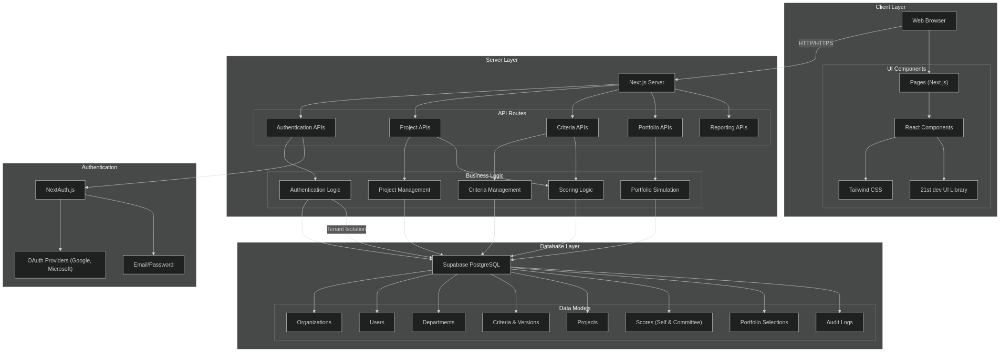
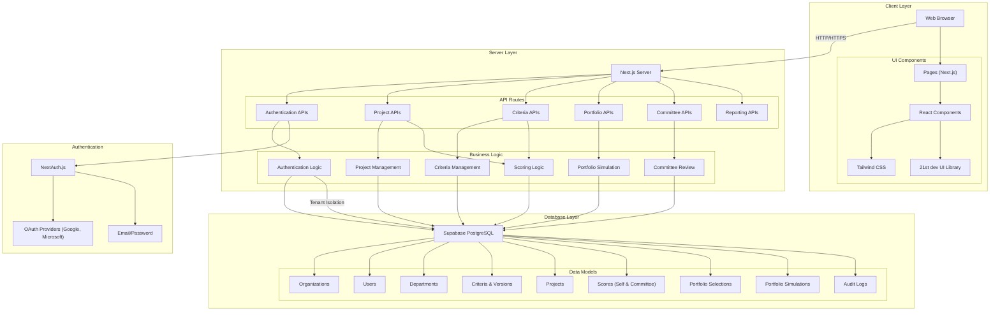
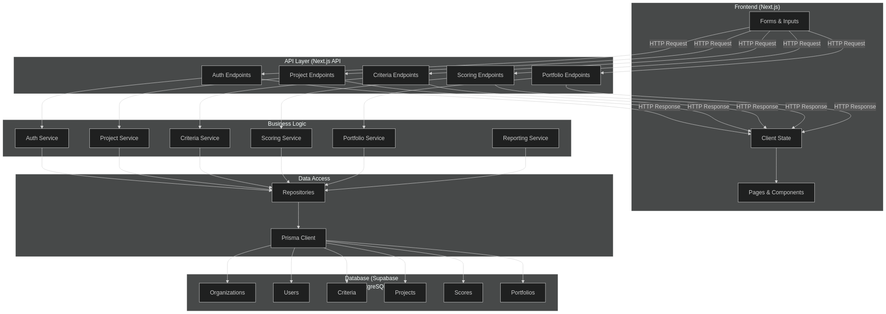
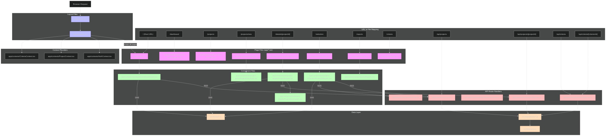

# PrimePM System Documentation

This directory contains the diagram source code and images for the PrimePM system architecture.

## How to Generate Images

1. Copy the Mermaid code for each diagram below
2. Visit [Mermaid Live Editor](https://mermaid.live/)
3. Paste the code into the editor
4. Use the "Export" button to download as PNG or SVG
5. Save the image in this directory with the appropriate filename

## Diagram Source Code

### System Architecture (system_architecture.png)




### Data Flow (data_flow.png)

```mermaid
flowchart TD
    subgraph "Frontend (Next.js)"
        FE_Pages[Pages & Components]
        FE_State[Client State]
        FE_Forms[Forms & Inputs]
    end
    
    subgraph "API Layer (Next.js API Routes)"
        API_Auth[Auth Endpoints]
        API_Projects[Project Endpoints]
        API_Criteria[Criteria Endpoints]
        API_Scoring[Scoring Endpoints]
        API_Committee[Committee Endpoints]
        API_Portfolio[Portfolio Endpoints]
        API_Simulation[Simulation Endpoints]
    end
    
    subgraph "Business Logic"
        BL_Auth[Auth Service]
        BL_Projects[Project Service]
        BL_Criteria[Criteria Service]
        BL_Scoring[Scoring Service]
        BL_Committee[Committee Service]
        BL_Portfolio[Portfolio Service]
        BL_Simulation[Simulation Service]
        BL_Reports[Reporting Service]
    end
    
    subgraph "Data Access"
        DA_Repositories[Repositories]
        DA_Prisma[Prisma Client]
    end
    
    subgraph "Database (Supabase PostgreSQL)"
        DB_Organizations[Organizations]
        DB_Users[Users]
        DB_Criteria[Criteria]
        DB_Projects[Projects]
        DB_Scores[Scores]
        DB_Committee[Committee Scores]
        DB_Portfolios[Portfolio Selections]
        DB_Simulations[Portfolio Simulations]
    end

    %% Frontend to API Layer
    FE_Forms -->|HTTP Request| API_Auth
    FE_Forms -->|HTTP Request| API_Projects
    FE_Forms -->|HTTP Request| API_Criteria
    FE_Forms -->|HTTP Request| API_Scoring
    FE_Forms -->|HTTP Request| API_Committee
    FE_Forms -->|HTTP Request| API_Portfolio
    FE_Forms -->|HTTP Request| API_Simulation
    
    %% API Layer to Business Logic
    API_Auth --> BL_Auth
    API_Projects --> BL_Projects
    API_Criteria --> BL_Criteria
    API_Scoring --> BL_Scoring
    API_Committee --> BL_Committee
    API_Portfolio --> BL_Portfolio
    API_Simulation --> BL_Simulation
    
    %% Business Logic to Data Access
    BL_Auth --> DA_Repositories
    BL_Projects --> DA_Repositories
    BL_Criteria --> DA_Repositories
    BL_Scoring --> DA_Repositories
    BL_Committee --> DA_Repositories
    BL_Portfolio --> DA_Repositories
    BL_Simulation --> DA_Repositories
    BL_Reports --> DA_Repositories
    
    %% Data Access to Database
    DA_Repositories --> DA_Prisma
    DA_Prisma --> DB_Organizations
    DA_Prisma --> DB_Users
    DA_Prisma --> DB_Criteria
    DA_Prisma --> DB_Projects
    DA_Prisma --> DB_Scores
    DA_Prisma --> DB_Committee
    DA_Prisma --> DB_Portfolios
    DA_Prisma --> DB_Simulations
    
    %% API Layer to Frontend
    API_Auth -->|HTTP Response| FE_State
    API_Projects -->|HTTP Response| FE_State
    API_Criteria -->|HTTP Response| FE_State
    API_Scoring -->|HTTP Response| FE_State
    API_Committee -->|HTTP Response| FE_State
    API_Portfolio -->|HTTP Response| FE_State
    API_Simulation -->|HTTP Response| FE_State
    
    %% Frontend State to Pages
    FE_State --> FE_Pages
```




### URL to File Mapping (url_file_mapping.png)


```mermaid
flowchart TD
    classDef pageFiles fill:#f9f,stroke:#333,stroke-width:2px
    classDef layoutFiles fill:#bbf,stroke:#333,stroke-width:2px
    classDef componentFiles fill:#bfb,stroke:#333,stroke-width:2px
    classDef apiFiles fill:#fbb,stroke:#333,stroke-width:2px
    classDef dataFiles fill:#fdb,stroke:#333,stroke-width:2px
    
    Browser[Browser Request]
    
    subgraph "URL to File Mapping"
        URL_Root["/ (Root URL)"]
        URL_Dashboard["/dashboard"]
        URL_Projects["/projects"]
        URL_ProjectsNew["/projects/new"]
        URL_Details["/details/[projectId]"]
        URL_Selection["/selection"]
        URL_Reports["/reports"]
        URL_Criteria["/criteria"]
        URL_Committee["/committee"]
        
        URL_API_Projects["/api/projects"]
        URL_API_Projects_ID["/api/projects/[projectId]"]
        URL_API_Criteria["/api/criteria"]
        URL_API_Criteria_ID["/api/criteria/[criterionId]"]
        URL_API_Committee["/api/committee"]
        URL_API_Committee_Scores["/api/committee/scores"]
        URL_API_Portfolio["/api/portfolios"]
        URL_API_Simulation["/api/simulations"]
    end
    
    subgraph "Page Files (app/*.tsx)"
        Page_Root["app/page.tsx"]:::pageFiles
        Page_Dashboard["app/dashboard/page.tsx"]:::pageFiles
        Page_Projects["app/projects/page.tsx"]:::pageFiles
        Page_ProjectsNew["app/projects/new/page.tsx"]:::pageFiles
        Page_Details["app/details/[projectId]/page.tsx"]:::pageFiles
        Page_Selection["app/selection/page.tsx"]:::pageFiles
        Page_Reports["app/reports/page.tsx"]:::pageFiles
        Page_Criteria["app/criteria/page.tsx"]:::pageFiles
        Page_Committee["app/committee/page.tsx (To be created)"]:::pageFiles
    end
    
    subgraph "Layout Files"
        RootLayout["app/layout.tsx"]:::layoutFiles
        Providers["app/providers.tsx"]:::layoutFiles
    end
    
    subgraph "Component Files"
        subgraph "Project Components"
            ProjectDetails["app/details/components/ProjectDetails.tsx"]:::componentFiles
            ProjectInformation["app/details/components/ProjectInformation.tsx"]:::componentFiles
            ProjectSearchPage["app/details/components/ProjectSearchPage.tsx"]:::componentFiles
            ProjectsTable["app/details/components/ProjectsTable.tsx"]:::componentFiles
        end
        
        subgraph "Selection Components"
            ProjectSelection["app/selection/components/ProjectSelection.tsx"]:::componentFiles
            ProjectMatrix["app/selection/components/ProjectMatrix.tsx"]:::componentFiles
            ProjectCard["app/selection/components/ProjectCard.tsx"]:::componentFiles
            ProjectSelectionTable["app/selection/components/ProjectSelectionTable.tsx"]:::componentFiles
        end
        
        subgraph "Dashboard Components"
            Dashboard["app/_components/dashboard/Dashboard.tsx"]:::componentFiles
            BentoMetrics["app/_components/dashboard/BentoMetrics.tsx"]:::componentFiles
            StatusChart["app/_components/dashboard/StatusChart.tsx"]:::componentFiles
            ScoreQuadrantChart["app/_components/dashboard/ScoreQuadrantChart.tsx"]:::componentFiles
            TopProjects["app/_components/dashboard/TopProjects.tsx"]:::componentFiles
        end
        
        subgraph "Committee Components (To be created)"
            CommitteeReview["app/_components/committee/CommitteeReview.tsx"]:::componentFiles
            CommitteeDashboard["app/_components/committee/CommitteeDashboard.tsx"]:::componentFiles
            ProjectList["app/_components/committee/ProjectList.tsx"]:::componentFiles
            ProjectScoring["app/_components/committee/ProjectScoring.tsx"]:::componentFiles
            ScoringCard["app/_components/committee/ScoringCard.tsx"]:::componentFiles
        end
        
        subgraph "UI Components"
            PageLayout["app/_components/layout/PageLayout.tsx"]:::componentFiles
            Sidebar["app/_components/layout/Sidebar.tsx"]:::componentFiles
            AnimatedGradient["app/_components/ui/AnimatedGradient.tsx"]:::componentFiles
            BentoCard["app/_components/ui/BentoCard.tsx"]:::componentFiles
            ConfirmationDialog["app/_components/ui/ConfirmationDialog.tsx"]:::componentFiles
        end
    end
    
    subgraph "API Route Handlers"
        API_Projects["app/api/projects/route.ts"]:::apiFiles
        API_Projects_ID["app/api/projects/[projectId]/route.ts"]:::apiFiles
        API_Projects_Scores["app/api/projects/[projectId]/scores/route.ts"]:::apiFiles
        API_Criteria["app/api/criteria/[criterionId]/route.ts"]:::apiFiles
        API_Criteria_Versions["app/api/criteria/versions/route.ts"]:::apiFiles
        API_Committee_Route["app/api/committee/route.ts (To be created)"]:::apiFiles
        API_Committee_Scores["app/api/committee/scores/route.ts (To be created)"]:::apiFiles
        API_Portfolio_Route["app/api/portfolios/route.ts"]:::apiFiles
        API_Simulation_Route["app/api/simulations/route.ts (To be created)"]:::apiFiles
    end
    
    subgraph "Context Providers"
        AuthContext["app/_contexts/AuthContext.tsx"]
        ProjectContext["app/_contexts/ProjectContext.tsx"]
        CriteriaContext["app/_contexts/CriteriaContext.tsx"]
        DepartmentContext["app/_contexts/DepartmentContext.tsx"]
        ProjectSearchContext["app/_contexts/ProjectSearchContext.tsx"]
        CommitteeContext["app/_contexts/CommitteeContext.tsx (To be created)"]
    end
    
    subgraph "Data Layer"
        Repositories["app/_repositories/*.ts"]:::dataFiles
        Hooks["app/_hooks/*.ts"]:::dataFiles
        PrismaClient["app/_lib/prisma.ts"]:::dataFiles
    end
    
    %% URL to Page File mapping
    URL_Root --> Page_Root
    URL_Dashboard --> Page_Dashboard
    URL_Projects --> Page_Projects
    URL_ProjectsNew --> Page_ProjectsNew
    URL_Details --> Page_Details
    URL_Selection --> Page_Selection
    URL_Reports --> Page_Reports
    URL_Criteria --> Page_Criteria
    URL_Committee --> Page_Committee
    
    %% URL to API mapping
    URL_API_Projects --> API_Projects
    URL_API_Projects_ID --> API_Projects_ID
    URL_API_Criteria --> API_Criteria
    URL_API_Criteria_ID --> API_Criteria
    URL_API_Committee --> API_Committee_Route
    URL_API_Committee_Scores --> API_Committee_Scores
    URL_API_Portfolio --> API_Portfolio_Route
    URL_API_Simulation --> API_Simulation_Route
    
    %% Page to Component mapping
    Page_Root --> Dashboard
    Page_Selection --> ProjectSelection
    Page_Details --> ProjectDetails
    Page_Committee --> CommitteeReview
    
    %% Layout relationships
    Browser --> RootLayout
    RootLayout --> Providers
    Providers --> |wraps all pages| Page_Root
    
    %% Context relationships
    Providers --> AuthContext
    Providers --> ProjectContext
    Providers --> CriteriaContext
    Providers --> DepartmentContext
    Providers --> ProjectSearchContext
    Providers --> CommitteeContext
    
    %% Data flow for API routes
    API_Projects --> Repositories
    API_Projects_ID --> Repositories
    API_Criteria --> Repositories
    API_Committee_Route --> Repositories
    API_Committee_Scores --> Repositories
    API_Portfolio_Route --> Repositories
    API_Simulation_Route --> Repositories
    Repositories --> PrismaClient
    
    %% Component to API data flow
    Dashboard --> |fetch| API_Projects
    ProjectDetails --> |fetch| API_Projects_ID
    ProjectSelection --> |fetch| API_Projects
    ProjectSelection --> |fetch| API_Criteria_Versions
    CommitteeReview --> |fetch| API_Committee_Route
    CommitteeReview --> |fetch| API_Committee_Scores
