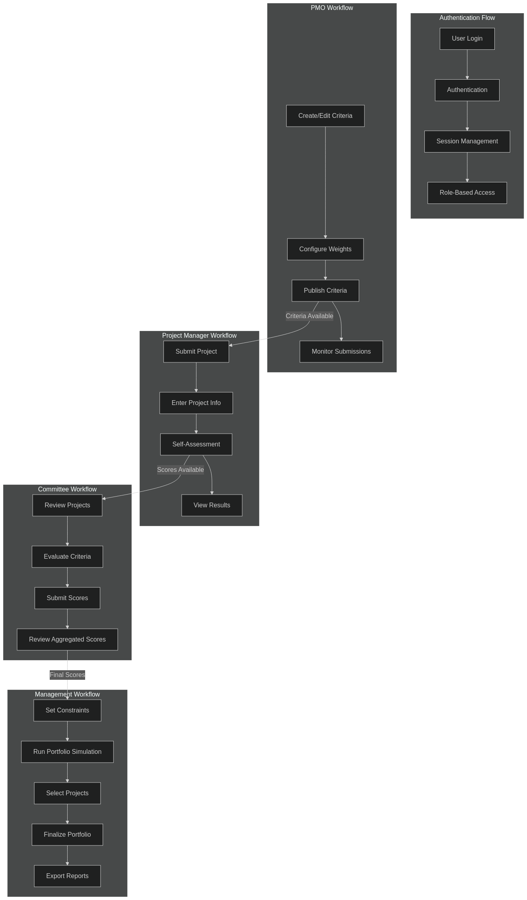
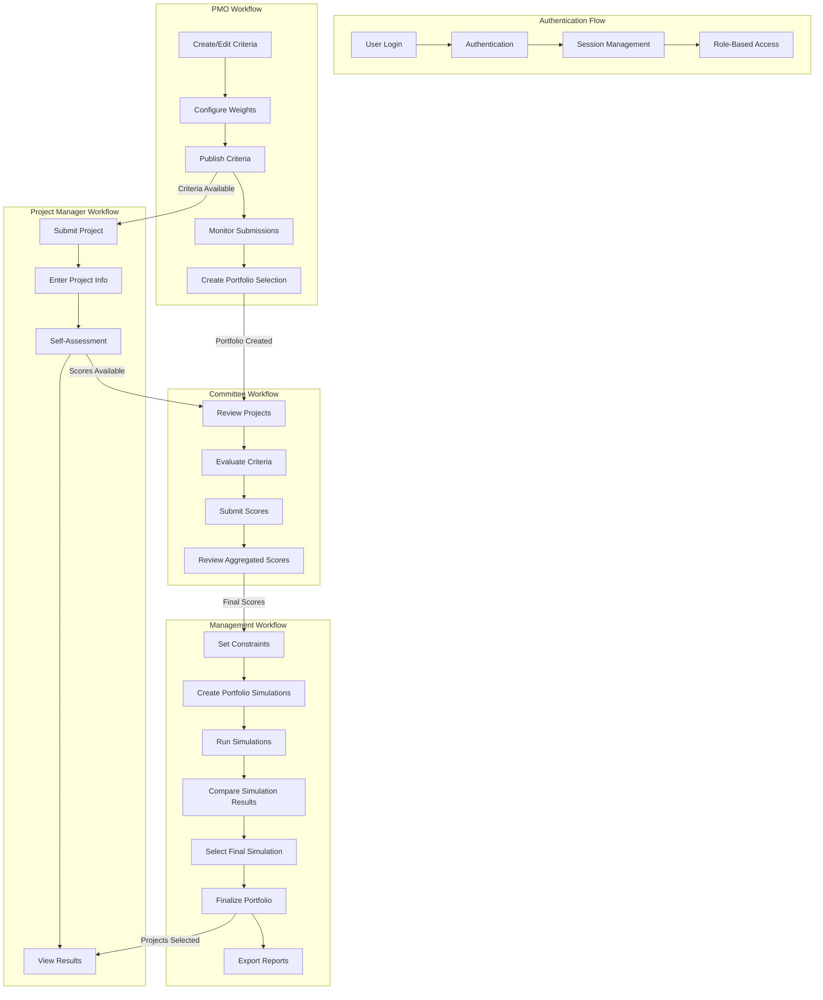
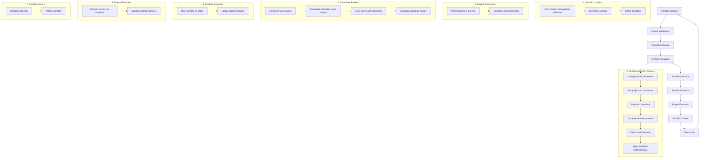
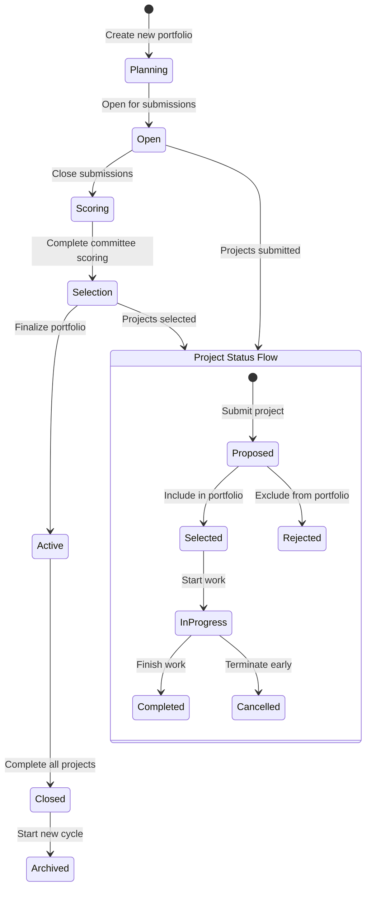
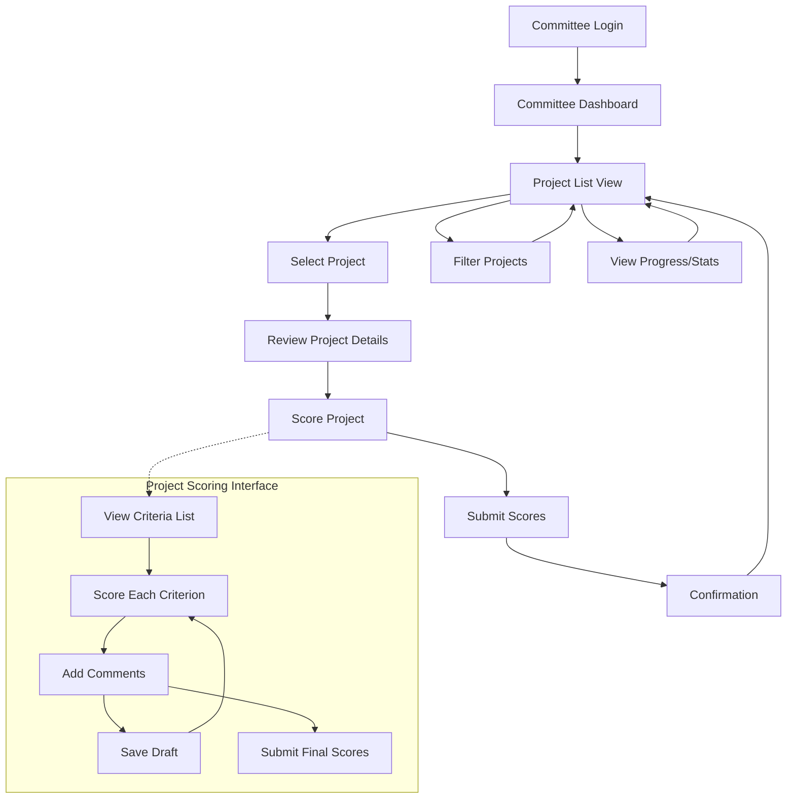
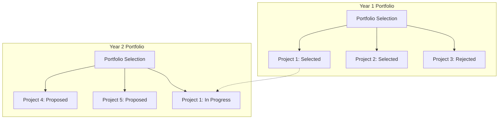

# Process Flow Documentation

This document details the user workflows and process flows for the PrimePM system, with a focus on the Portfolio Selection and Committee Review processes.

## General User Workflows

### User Workflows (user_workflows.png)

## Portfolio Selection Process

### Portfolio Selection Lifecycle (portfolio_lifecycle.png)

### Portfolio Status Transitions (portfolio_status_transitions.png)

## Committee Review Process

### Committee Review Workflow (committee_review_workflow.png)

## Detailed Process Descriptions

### 1. Portfolio Creation Stage

**Actors**: PMO (Portfolio Management Office)

**Process**:
1. PMO creates a new PortfolioSelection record with:
   - Name, description, version, year
   - Status = 'Planning'
   - Start and end dates
   - Submission and scoring deadlines
2. PMO links the appropriate CriteriaVersion to be used for this selection cycle
3. PMO configures any constraints or requirements for the portfolio

**Database Impact**:
- New PortfolioSelection record created
- Status set to 'Planning'

**UI Components**:
- Portfolio creation form
- Criteria version selector
- Date pickers for deadlines

### 2. Project Submission Stage

**Actors**: Project Managers, PMO

**Process**:
1. PMO changes portfolio status to 'Open'
2. Project Managers submit new projects or update existing ones
3. Each project is linked to the current portfolio selection
4. Project Managers complete self-assessment for each criterion
5. Projects are marked with portfolioStatus = 'Proposed'

**Database Impact**:
- PortfolioSelection status updated to 'Open'
- New Project records created
- ProjectCriteriaScore records created for self-assessment
- Projects linked to current portfolio via portfolioSelectionId
- Projects marked with portfolioStatus = 'Proposed'

**UI Components**:
- Project submission form
- Self-assessment interface
- Project list view with submission status

### 3. Committee Review Stage

**Actors**: Committee Members, PMO

**Process**:
1. PMO changes portfolio status to 'Scoring'
2. PMO creates CommitteeReviewSession(s)
3. Committee members review projects and their self-assessments
4. Committee members score each criterion for each project
5. Scores can be saved as drafts and later submitted
6. Once all scores are submitted, aggregate scores are calculated

**Database Impact**:
- PortfolioSelection status updated to 'Scoring'
- CommitteeReviewSession records created
- CommitteeScore records created for each score
- CommitteeScore status transitions: DRAFT → SUBMITTED → APPROVED

**UI Components**:
- Committee dashboard
- Project list for committee
- Scoring interface with card-based selection
- Progress tracking for committee members

### 4. Portfolio Simulation Stage

**Actors**: Management, PMO

**Process**:
1. PMO changes portfolio status to 'Selection'
2. Management defines constraints (budget limits, resource caps, etc.)
3. Multiple portfolio simulations are created with different parameters
4. Projects are added to simulations and marked as selected or not
5. Simulations are run and results compared
6. Management selects the final simulation

**Database Impact**:
- PortfolioSelection status updated to 'Selection'
- PortfolioSimulation records created
- PortfolioSimulationProject records created
- One simulation marked with isSelected = true

**UI Components**:
- Simulation creation interface
- Constraint definition form
- Simulation comparison view
- Project selection matrix

### 5. Portfolio Activation Stage

**Actors**: Management, PMO

**Process**:
1. PMO changes portfolio status to 'Active'
2. Selected projects are marked with portfolioStatus = 'Selected'
3. Non-selected projects are marked with portfolioStatus = 'Rejected'
4. The portfolio becomes the active portfolio for the organization

**Database Impact**:
- PortfolioSelection status updated to 'Active'
- PortfolioSelection isActive set to true
- Project portfolioStatus updated to 'Selected' or 'Rejected'

**UI Components**:
- Portfolio activation confirmation
- Portfolio summary view
- Project status dashboard

### 6. Project Execution Stage

**Actors**: Project Managers, PMO

**Process**:
1. Selected projects move to portfolioStatus = 'In Progress'
2. Project Managers update project status as work progresses
3. PMO monitors overall portfolio progress

**Database Impact**:
- Project portfolioStatus updated to 'In Progress'
- Project status updated throughout execution

**UI Components**:
- Project tracking dashboard
- Status update forms
- Portfolio progress visualization

### 7. Portfolio Closure Stage

**Actors**: PMO

**Process**:
1. As projects complete, they are marked with portfolioStatus = 'Completed'
2. Projects that are terminated early are marked with portfolioStatus = 'Cancelled'
3. Once all projects are either Completed or Cancelled, the portfolio can be closed
4. PMO changes portfolio status to 'Closed'

**Database Impact**:
- Project portfolioStatus updated to 'Completed' or 'Cancelled'
- PortfolioSelection status updated to 'Closed'
- PortfolioSelection isActive set to false

**UI Components**:
- Portfolio closure confirmation
- Final portfolio report generation

### 8. New Cycle Initiation

**Actors**: PMO

**Process**:
1. Previous portfolio is archived (status = 'Archived')
2. New portfolio selection cycle is created
3. Process begins again at Portfolio Creation stage

**Database Impact**:
- Previous PortfolioSelection status updated to 'Archived'
- New PortfolioSelection record created

**UI Components**:
- Portfolio archival confirmation
- New cycle creation form

## Multi-Year Portfolio Management

The system supports managing multiple portfolio selection cycles simultaneously:

This allows:
1. Tracking projects across multiple years
2. Continuing projects from previous portfolios
3. Historical reporting across portfolio cycles
4. Comparing performance year-over-year
